

  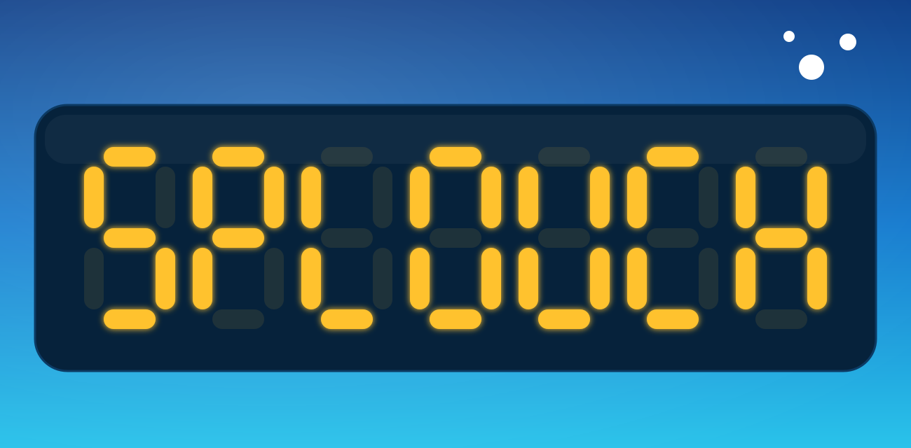

<a href="#splouch-for-android">English</a> · <a href="#splouch-fr">Français</a>

# Splouch for Android

The spectator app for [Splouch](https://github.com/olivierouellet/Splouch) swim meets.

Splouch reads the pool's timing console and puts a live scoreboard on the TV at the
pool. This app puts the same board on a phone: live times lane by lane, each heat's
results as soon as it ends, and the meet's schedule with a filter for your swimmers and
clubs. It connects to the meet's own server on the pool's network, or to the Splouch
cloud from anywhere. English, French and Spanish, light or dark.

---

## Screenshots

| Scoreboard | Results | Schedule |
| --- | --- | --- |
| 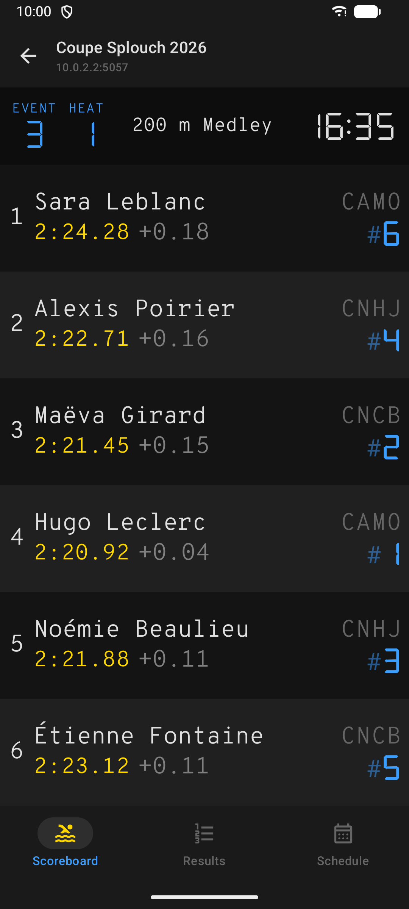 | 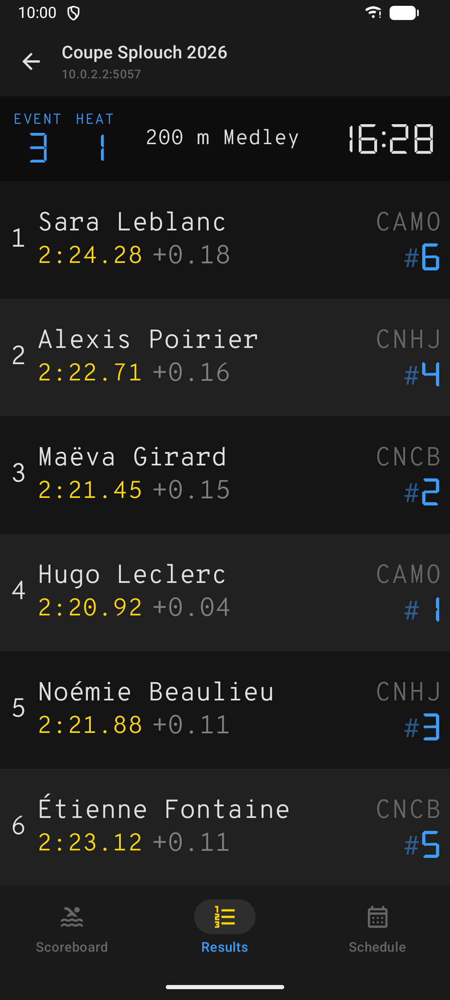 | 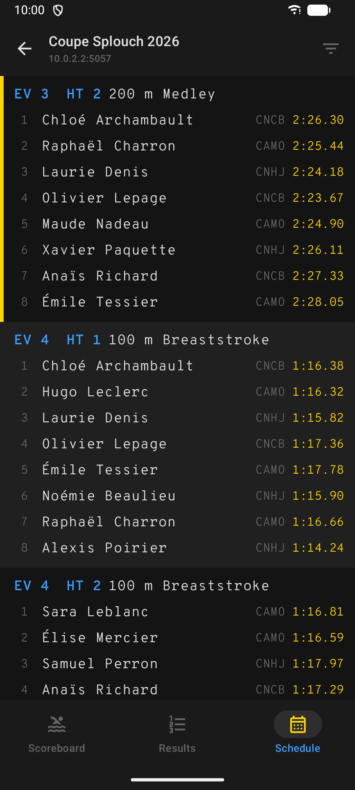 |
| 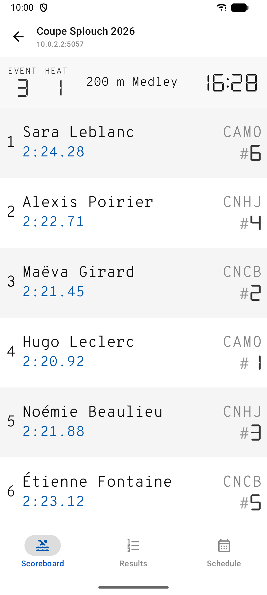 | 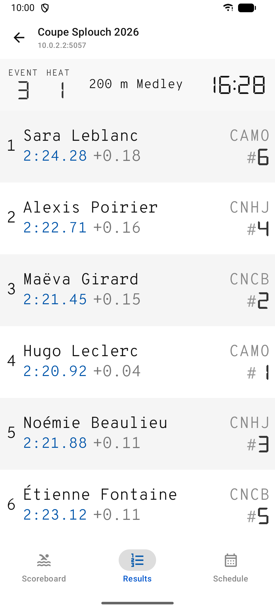 | 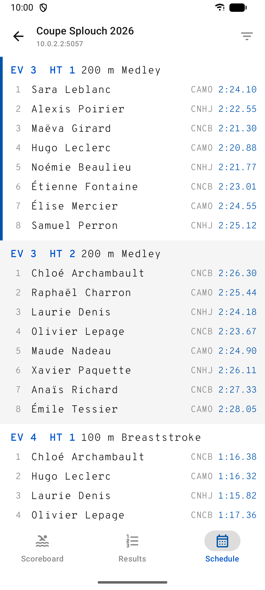 |

Swimmers, clubs and times are fictional (a bundled test recording). French in
[`screenshots/fr/`](screenshots/fr); the Play listing graphics are in [`store/`](store).

---

## Related repositories

| | |
| --- | --- |
| [Splouch](https://github.com/olivierouellet/Splouch) | The scoreboard server, the cloud relay, and the contracts this app follows |
| [Splouch-ios](https://github.com/olivierouellet/Splouch-ios) | Spectator app for iOS |

---

## Documentation

| | |
| --- | --- |
| [Development](docs/development.md) | Layout, building and testing, dev servers, strings |
| [Emulator](emulator.md) | Running a debug build on an AVD and driving it with `adb` |
| [Parity ledger](parity.md) | One row per feature of the mobile contract: built here, and if not, why |
| [Screenshots](screenshots/README.md) | What is on them and how to retake them |
| [Store graphics](store/README.md) | The Google Play listing images and how they are made |

---

## Community

| | |
| --- | --- |
| [Contributing](CONTRIBUTING.md) | The contracts, setup, the checks a PR must pass, conventions, reporting a bug |
| [Security](SECURITY.md) | Reporting a vulnerability, what the app assumes about the network it is on |
| [Code of Conduct](CODE_OF_CONDUCT.md) | Contributor Covenant 2.1 |

---

## License

The app is MIT licensed — see [`LICENSE`](LICENSE). The bundled fonts are not:
each one keeps its own SIL Open Font License, shipped verbatim in
`app/font-licenses/`.

---

## Splouch pour Android — Français

<a href="#splouch-for-android">English</a> · <a href="#splouch-fr">Français</a>

L'application spectateur des compétitions de natation [Splouch](https://github.com/olivierouellet/Splouch).

Splouch lit la console de chronométrage de la piscine et affiche un tableau en direct sur
le téléviseur du bord de piscine. Cette application met le même tableau sur un
téléphone : les temps en direct couloir par couloir, les résultats de chaque série dès
qu'elle se termine, et l'horaire de la compétition avec un filtre pour vos nageurs et vos
clubs. Elle se connecte au serveur de la compétition sur le réseau de la piscine, ou au
cloud Splouch de n'importe où. En français, en anglais et en espagnol, en clair ou en
sombre.

---

## Captures d'écran

| Tableau | Résultats | Horaire |
| --- | --- | --- |
| 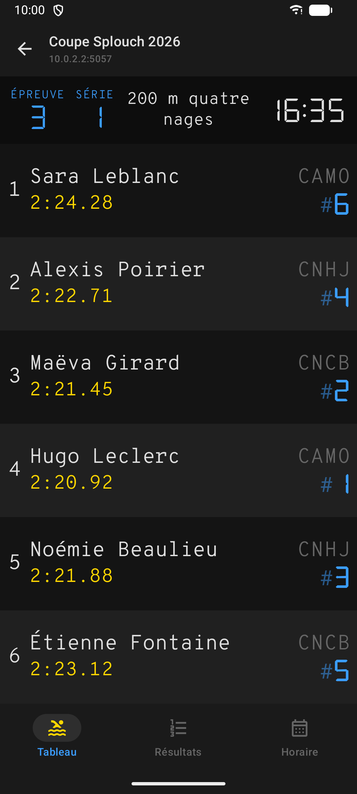 | 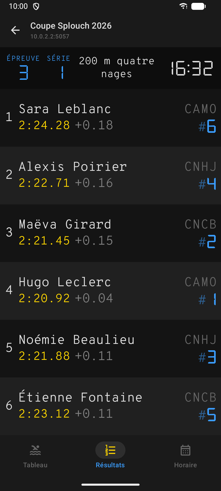 | 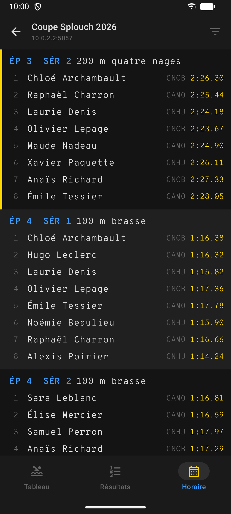 |
| 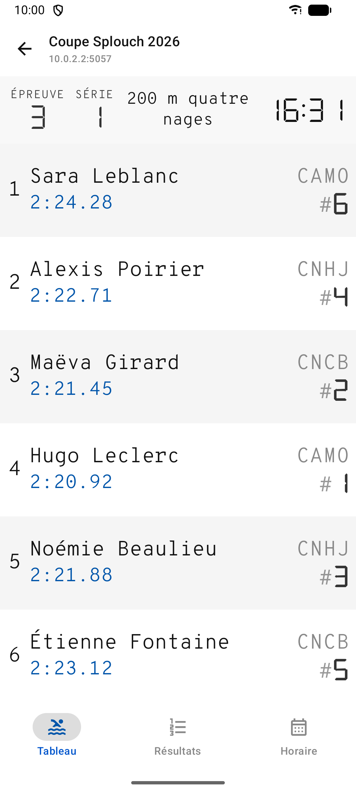 | 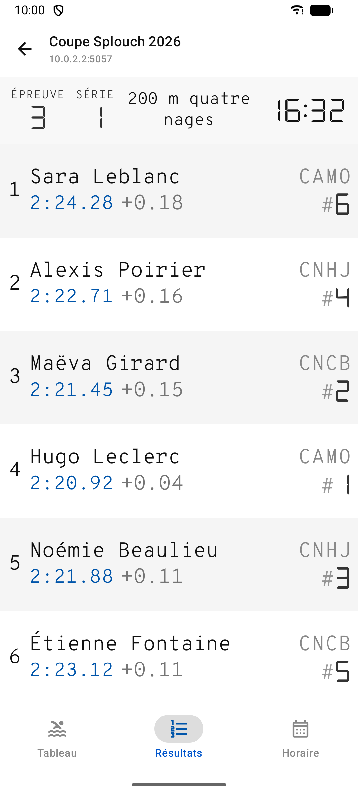 | 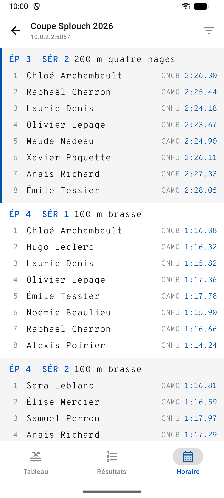 |

Nageurs, clubs et temps fictifs (enregistrement de test inclus). Les images de la fiche
Google Play sont dans [`store/`](store).

---

## Dépôts associés

| | |
| --- | --- |
| [Splouch](https://github.com/olivierouellet/Splouch) | Le serveur du tableau, le relais cloud et les contrats que suit cette application |
| [Splouch-ios](https://github.com/olivierouellet/Splouch-ios) | Application spectateur pour iOS |

---

## Guides et documentation

Ces documents n'existent qu'en anglais.

| | |
| --- | --- |
| [Développement](docs/development.md) | Organisation, compilation et tests, serveurs de développement, textes |
| [Émulateur](emulator.md) | Lancer une version de débogage sur un AVD et la piloter avec `adb` |
| [Registre de parité](parity.md) | Une ligne par fonctionnalité du contrat mobile : réalisée ici, et sinon pourquoi |
| [Captures d'écran](screenshots/README.md) | Ce qu'elles montrent et comment les refaire |
| [Images de la fiche](store/README.md) | Les images de la fiche Google Play et leur fabrication |

---

## Communauté

| | |
| --- | --- |
| [Contribuer](CONTRIBUTING.md) | Les contrats, mise en place, vérifications requises pour une PR, conventions, signaler un bogue |
| [Sécurité](SECURITY.md) | Signaler une vulnérabilité, ce que l'application suppose du réseau |
| [Code de conduite](CODE_OF_CONDUCT.md) | Contributor Covenant 2.1 |

---

## Licence

L'application est sous licence MIT — voir [`LICENSE`](LICENSE). Les polices incluses
ne le sont pas : chacune garde sa propre licence SIL Open Font License, fournie telle
quelle dans `app/font-licenses/`.
